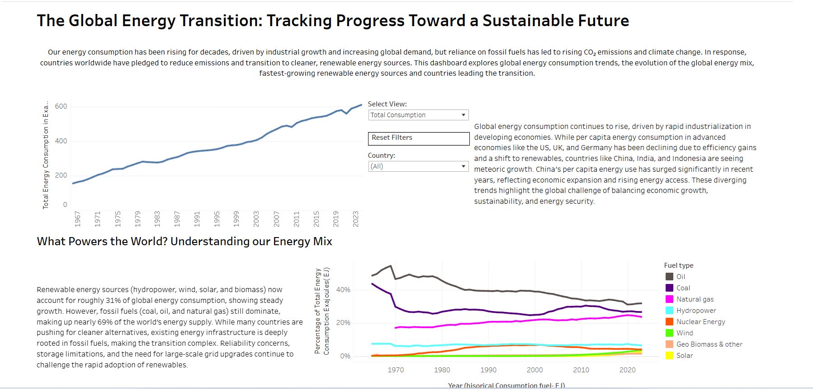
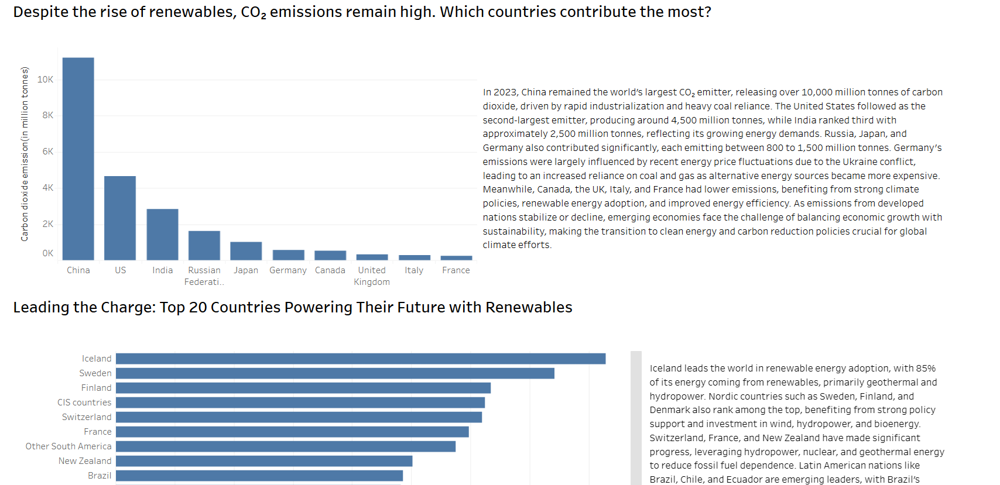

An interactive Tableau dashboard exploring global energy trends (1965–2023). It highlights the shift from fossil fuels to renewables and analyzes country-level success stories in the energy transition, showcasing how innovation, investment, and policy impact sustainable outcomes.

# [🔗 View Dashboard on Tableau Public](https://public.tableau.com/views/energy_dashboard_v3/Dashboard1?:language=en-US&:sid=&:redirect=auth&:display_count=n&:origin=viz_share_link)

# Project Summary
This Tableau project analyzes global energy trends between 1965 and 2023, using interactive data visualizations to uncover key insights into the world’s transition from fossil fuels to renewables. It draws from country-level data on energy consumption, fuel mix, CO₂ emissions, and renewable adoption to explore challenges and successes in global sustainability efforts.

## Part 1: Energy Consumption Patterns
Global energy consumption has steadily increased, particularly driven by industrial growth in Asia. While per capita consumption has plateaued in advanced economies like the United States and even declined in parts of Europe, countries such as China, India, and Indonesia are seeing significant growth in total and per capita energy demand. China alone now accounts for over 25% of global energy consumption, reflecting its scale of industrialization. Southeast Asia emerges as a key contributor to global demand expansion.

## Part 2: Understanding the Global Energy Mix
Despite progress, fossil fuels still dominate, accounting for approximately 69% of global energy supply. Renewables (hydropower, wind, solar, biomass) make up 31%, showing steady growth. The transition remains complex due to:

-> Deep infrastructure reliance on fossil fuels

-> Grid and storage limitations

-> Energy reliability concerns

Countries with higher fossil fuel dependence often show delayed shifts, while others have diversified their energy portfolios. Line charts across decades highlight these transitions, with oil and coal declining slowly in some countries while natural gas and renewables increase.

## Part 3: What's Rising in Clean Energy Alternatives
Among renewables:

Hydropower remains the largest contributor (~16% globally in electricity generation and 6% as total energy consumption )

Wind is the second-largest and growing steadily

Solar has the fastest growth rate, with an average 30% annual increase over the last decade

Geothermal and bioenergy are expanding in regions with enabling policy and investments like Iceland and US is also exploring this option with steady based in drilling technology present already.

Nuclear energy, while not renewable, is gaining attention as a low-carbon source, especially in countries like France.

## Part 4: CO₂ Emissions Remain High
In 2023:

China emitted over 10,000 million tonnes of CO₂, the highest globally

USA followed with ~4,500 million tonnes

India emitted ~2,500 million tonnes, showing its growing energy demand

Germany, Russia, and Japan contributed significantly (800–1,500 million tonnes)

Countries like the UK, Canada, and France have managed to keep emissions relatively lower due to clean energy policies, efficiency improvements, and fuel-switching.

Emissions trends show a plateau or decline in developed nations, while developing economies face the challenge of managing growth and sustainability together.

## Part 5: Leaders in Energy Transition
Top countries by renewable share:

-> Iceland leads with 85% of energy from renewables (mainly geothermal and hydro)

-> Sweden, Finland, and Denmark benefit from strong wind and hydro policies

-> Brazil's energy mix is dominated by hydropower and biofuels

-> Chile is expanding solar and wind, and Uruguay emerges as a model for public private partnership in developing countries, providing an alternative to high subsidies.

-> Switzerland, Austria, and New Zealand have surpassed 40–60% renewable share

Notably, Germany, UK, and Canada are among the fastest G7 adopters. All top countries demonstrate that strategic investment, public-private partnerships, and long-term policy support are key to success.

## Part 6: Country-Level Success Stories

Several countries stand out for their quantifiable progress in clean energy adoption, backed by strategic policy and investment:

-> Iceland: Nearly 85% of electricity comes from renewable sources, primarily geothermal and hydropower. According to Energy Monitor, this shift has helped Iceland save an estimated 3.5% of GDP annually by reducing dependence on energy imports.

-> Brazil: By increasing its ethanol blending mandates to over 25%, Brazil has significantly cut oil imports while driving demand for biofuel production. Over 30% of its energy consumption comes from hydropower, making it one of the cleanest large-scale grids globally.

-> France: With over 40% of its total energy consumption supplied by nuclear power, France maintains one of the lowest carbon intensities per kWh in Europe. It is now investing in Small Modular Reactors (SMRs) to modernize and decentralize its nuclear infrastructure.

-> Chile: Solar power accounts for over 25% of total electricity generation in some regions, positioning Chile as Latin America’s solar leader, driven by high solar irradiance and progressive government incentives.

-> Denmark: Wind power contributes over 26% of Denmark’s total energy consumption. Government-industry partnerships and early investments helped it become the global leader in wind energy exports and innovation.

These examples reflect how measurable gains in economic efficiency, energy independence, and carbon reduction are achievable through coordinated efforts across sectors. Each case reinforces the importance of long-term planning, infrastructure investment, and policy support in the energy transition.

## Recommendations & Next Steps
1. Accelerate Renewable Infrastructure in High-Growth Economies
Countries like China, India, and Indonesia are driving global energy demand. Investment in scalable renewable infrastructure (especially solar and wind) and policy incentives is crucial to prevent long-term fossil lock-in. China is already a leading example of creating jobs as well as cleaner alternatives with over 75% solar panel supply coming from China alone.

2. Target Energy Efficiency in Advanced Economies
Since energy use has plateaued in developed nations, the focus should shift toward improving energy efficiency, retrofitting grids, and transitioning remaining fossil-based sectors (like heating and transport) to clean alternatives. The plateau of demand can also be attributed to rising energy prices due to geopolitcal instability, energy source diversification cal play a key role to energy security in these economies. 

3. Expand Energy Storage & Grid Modernization
As renewables rise, countries must invest in grid flexibility and storage solutions (e.g., batteries, pumped hydro) to ensure reliability. This is especially important for solar- and wind-heavy systems.

4. Strengthen Public-Private Partnerships
Success stories like Denmark and Chile show that coordinated government policy, private innovation, and long-term funding mechanisms are key to rapid transition. Similar frameworks should be replicated in emerging markets.

5. Support Resource Strategy for Critical Minerals
The rising importance of lithium, cobalt, nickel, and copper for clean energy tech highlights the need for transparent supply chains, sustainable mining practices, and regional exploration.

6. Prioritize Diversification for Energy Security
Countries overly reliant on a single energy source (e.g., coal or oil imports) should aim for a balanced mix of renewables and low-carbon sources (like nuclear or geothermal) to reduce geopolitical risk and ensure resilience.

7. Incentivize Biofuels and SMR Development
Brazil’s biofuel success and France’s investment in Small Modular Reactors (SMRs) offer scalable models for decarbonizing transport and baseload electricity, respectively. These solutions should be explored in similar geographies.

8. Embed Just Transition Principles
As economies shift, it’s essential to address job displacement, energy access, and affordability—especially in developing nations. Climate action must align with social equity.

## Data Source:
[The enery Institute](https://www.energyinst.org/statistical-review)

## The cleaned dataset used in this project is available on Kaggle:

🔗 [Global Energy Dataset (Cleaned) on Kaggle](https://www.kaggle.com/datasets/atharvarayar/global-energy-consumption)

> 📈 Over 1,000 views and 150+ downloads in the last 30 days.
